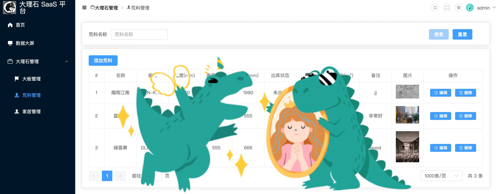

### 如果开源对你有帮助，也很希望得到你的鼓励，右上角Star🌟，等你点亮！

  ------------------------------------------------------------------

### 🌟交流+V：lucy2188687859

  ------------------------------------------------------------------

 ### 🌟 谁用我们

 #### 🌟 科石云仓 是 鸿蒙土拨鼠大理石开源系统的一个落地案例
 ------------------------------------------------------------------

# 鸿蒙土拨鼠大理石系统：全栈式云仓管理解决方案
## 关键词： 开源、鸿蒙APP、微信小程序、SaaS云平台、Go语言、Vue3、Element Plus、大理石管理、云仓系统

## ✍项目简介：

鸿蒙土拨鼠大理石系统是一套功能强大、易于部署的大理石云仓管理系统，涵盖鸿蒙APP、微信小程序、SaaS云平台和后台管理，助力大理石行业实现数字化转型升级。

## ✍项目结构：

### 鸿蒙App-HarmonyOS-Next-鸿蒙大理石App

#### 项目文件夹： TbsHarmonyOS

##### 软件架构：

1、开发语言：HarmonyOS-Next + Navigation路由导航

2、开发工具：DevEco Studio

3、项目运行：真机或模拟器

### 微信小程序-大理石小程序

#### 项目文件夹： front-mini-programe

##### 软件架构：

1、开发语言：vue3 + uniapp

2、开发工具：HBuilderX + 微信开发者工具

3、项目运行：HBuilderX点击运行--选择运行到小程序模拟器--微信开发者工具

小程序已上线，可直接搜索【科石】

### 大理石云平台

#### 项目文件夹： front-manager

##### 软件架构：

1、开发语言：vue3 + vite + Ts + Element Plus

2、开发工具：VS Code

3、项目运行：使用npm包管理工具

### 后台

#### 项目文件夹： backup

##### 软件架构：

1、开发语言：Go 语言 + goframe2 框架 + sqlite 文件数据库

说明：backup文件夹内的README文件包含项目介绍/项目启动/代码结构等

## 核心功能：

### 鸿蒙APP & 微信小程序:

面向用户，便捷查看:

1、首页: 实时查看库存数据、订单状态、行业资讯等关键信息，轻松掌握大理石行业动态。

2、大板展示: 精美图片展示各类大理石大板，支持筛选、搜索、收藏等功能，方便用户快速找到心仪产品。

3、荒料信息: 提供荒料规格、颜色、纹理等详细信息，方便用户了解原材料情况。

4、家居案例: 展示精美的大理石家居案例，为用户提供装修灵感。

5、联系我们: 提供企业联系方式、在线客服等功能，方便用户联系咨询。

### 项目截图：
        

### SaaS云平台:

面向客户，高效管理:

1、大板管理: 客户可便捷录入、编辑、删除大板信息，并上传高清图片，方便用户查看。

2、荒料管理: 客户可记录荒料入库、出库、库存等信息，实现荒料库存的精准管理。

3、家居案例管理: 客户可上传、编辑、删除家居案例，展示企业实力，吸引用户关注。

### 项目截图：
  
  

### 后台管理:

提供用户管理、权限控制、数据统计等后台管理功能，保障系统安全稳定运行。

项目优势：

1、全栈开源: 代码完全开源，方便用户二次开发和定制。

2、多端覆盖: 支持鸿蒙APP、微信小程序、Web端，满足用户不同场景使用需求。

3、功能清晰: APP和小程序面向用户，方便查看信息；云平台面向客户，便捷管理数据。

4、易于部署: 采用轻量级架构，部署简单，维护成本低。

欢迎贡献：

我们致力于打造一个开放、共享的大理石行业生态，欢迎各位开发者参与项目贡献，共同推动大理石行业数字化发展！

期待您的加入！
